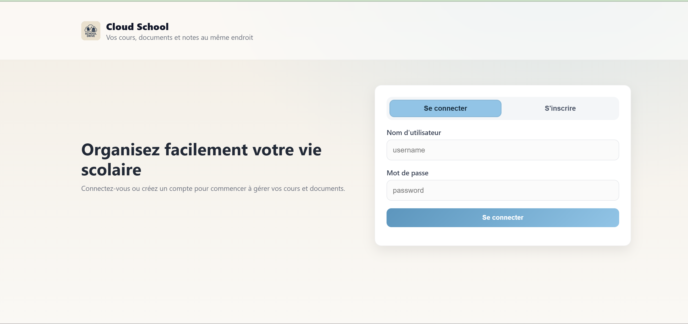
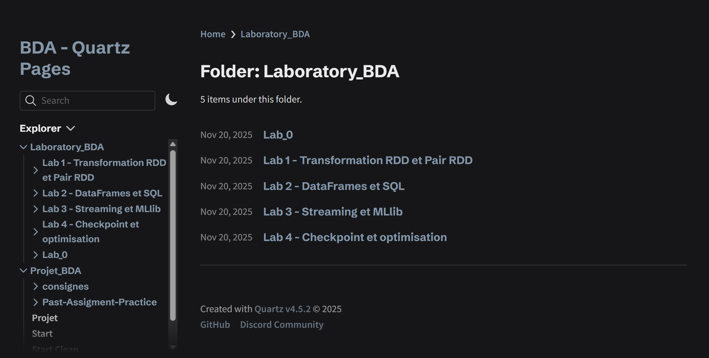
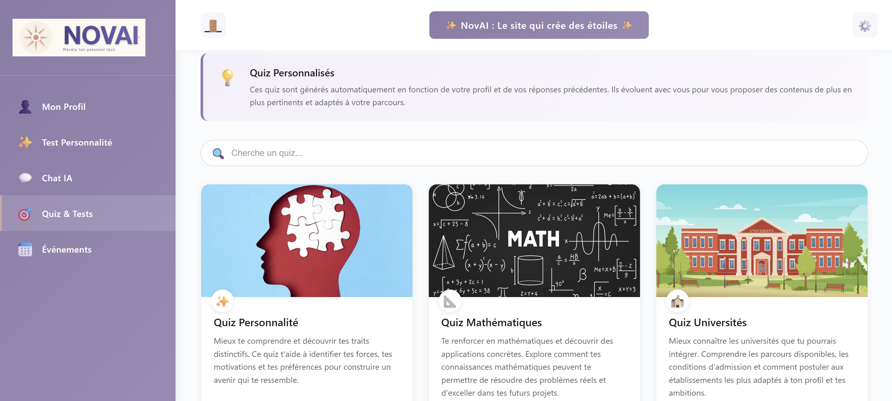
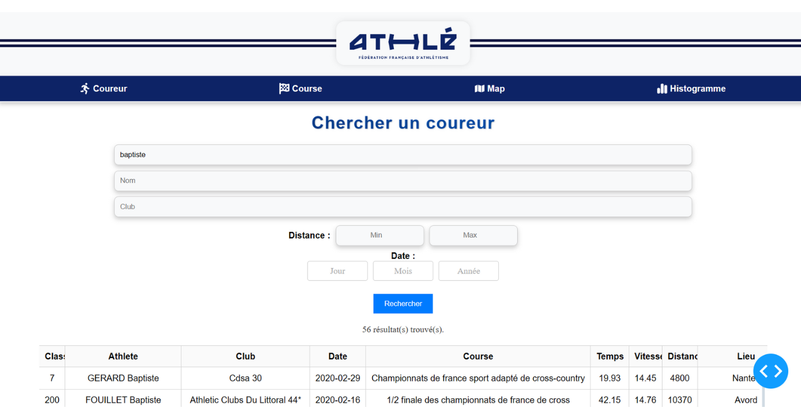

# 👋 Hi, I'm Rémi

🎓 Master's student in **AI & Data Science** at [ESIEE Paris](https://www.esiee.fr/en) (2021-2026)  
📊 Data Scientist in training — passionate about AI, Data Engineering, and Cloud solutions  
🌍 International experience (internships in UK, Spain & Erasmus in Cyprus)  
🏃 Athlete & former student association leader  

---

## 🛠 Tech Stack

**Languages**  
   

---

**Machine Learning / AI**  
   

---

**Databases**  
   

---

**Big Data & Cloud**  
   

---

**Data Analysis & Viz**  
   

---

**VR / AR**  
   

---

## 🚀 Projects

### My_First_WebApp
A fully functional web application project built with Python. This project demonstrates my ability to create end-to-end web solutions.

**Tech Stack:** Python  
**Status:** ✅ Active  
[View Repository](https://github.com/TrotiRemi/My_First_WebApp)

---

### Big-Data-Analytics-Project-And-Lab-With-Spark
A comprehensive school project featuring both educational labs and practical applications. Includes labs to learn Apache Spark and a real-world project predicting Bitcoin prices using Spark.

**Tech Stack:** JavaScript, Apache Spark  
**License:** MIT  
**Status:** ✅ Active  
[View Repository](https://github.com/TrotiRemi/Big-Data-Analytics-Project-And-Lab-With-Spark)

---

### NovAI-project
An AI initiative part of the Orange project titled "An AI for the global good". This project showcases my commitment to using AI for positive societal impact.

**Tech Stack:** HTML, AI/ML  
**Status:** ✅ Active  
[View Repository](https://github.com/TrotiRemi/NovAI-project)

---

### E4_Intership
A Unity-based VR project focused on collecting and analyzing Key Performance Indicators (KPIs) to predict Quality of Experience. This internship project demonstrates my expertise in VR development and data analytics.

**Tech Stack:** Unity, VR Development, Python (Jupyter Notebook)  
**Status:** ✅ Completed  
[View Repository](https://github.com/TrotiRemi/E4_Intership)

---

### Projet_E4
A collaborative data project focused on analyzing city data from Avignon. This project showcases my ability to work in teams and handle real-world data challenges.

**Tech Stack:** Python  
**Status:** ✅ Active  
[View Repository](https://github.com/TrotiRemi/Projet_E4)

---

### FFA_Data
A comprehensive data platform for finding and analyzing running competition results. This full-stack project demonstrates my expertise in data engineering, database design, DevOps, and cloud infrastructure. Features include web scraping, data aggregation, interactive dashboards, and AWS deployment.

**Tech Stack:** MongoDB, Elasticsearch, Dash, AWS, Docker, Python (Jupyter Notebook)  
**Status:** ✅ Active  
[View Repository](https://github.com/TrotiRemi/FFA_Data)

---

### Devops_Project
A hands-on DevOps training repository covering industry-standard practices and tools. Perfect for learning containerization, orchestration, and CI/CD pipelines.

**Tech Stack:** Docker, Kubernetes, CI/CD, Python (Jupyter Notebook)  
**Status:** ✅ Active  
[View Repository](https://github.com/TrotiRemi/Devops_Project)

---

## 📈 GitHub Stats

  

---

## 📫 Contact

- ✉️ remi.locquette@edu.esiee.fr  
- 🔗 [LinkedIn](https://www.linkedin.com/) (à compléter)  
- 🌐 [GitHub Profile](https://github.com/TrotiRemi)
